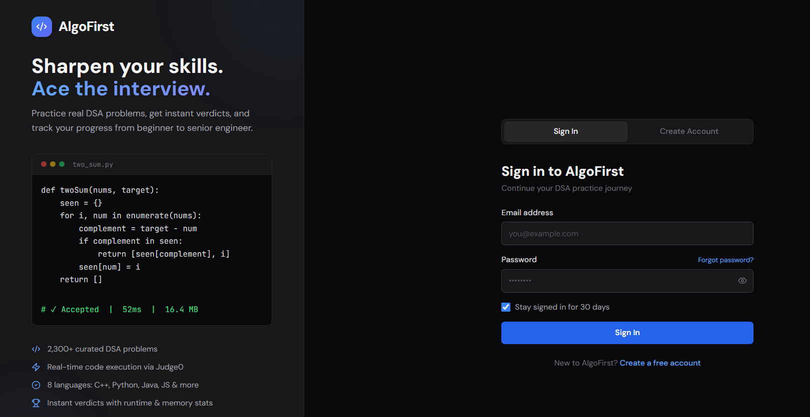
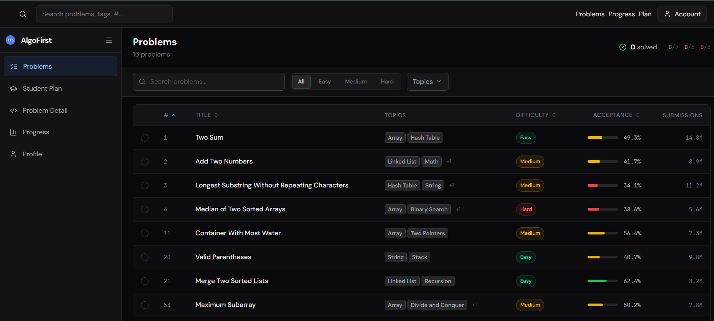
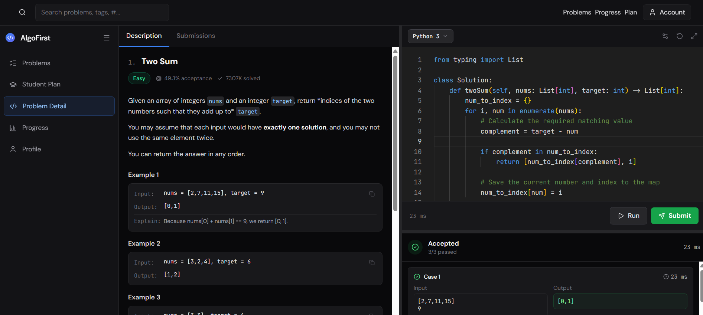
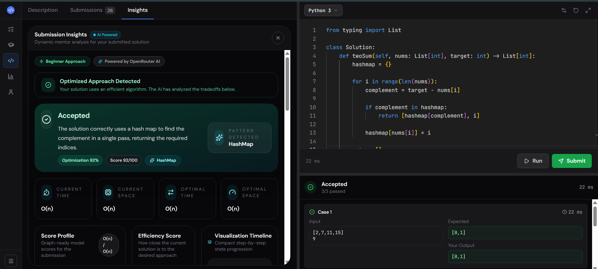
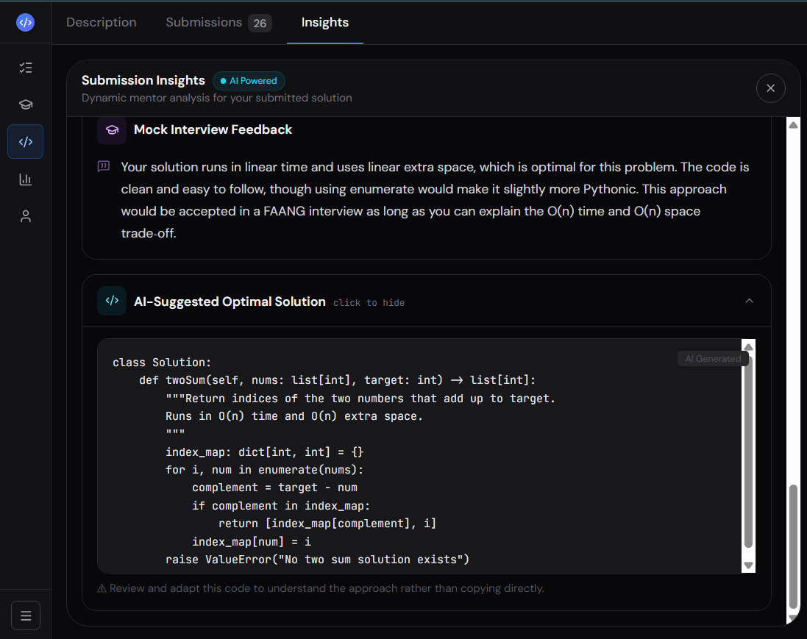
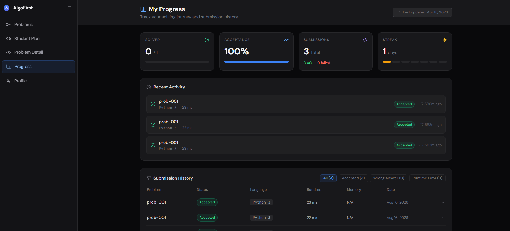
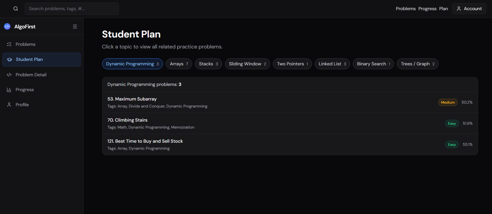

# AlgoFirst

> **AI-powered coding practice and assessment platform** for solving DSA problems, executing submissions, tracking progress, and receiving personalized AI feedback.

<p align="center">
  <strong>Practice DSA. Understand your mistakes. Prepare for interviews.</strong>
</p>

<p align="center">
  <a href="https://algo-first.vercel.app/sign-up-login-screen">Live Demo</a>
  ·
  <a href="https://github.com/SIDDU-2006/AlgoFirst">GitHub Repository</a>
</p>


---

## 📌 Overview

**AlgoFirst** is a full-stack coding practice platform built to provide an integrated environment for learning and practicing Data Structures and Algorithms.

The platform allows users to:

* Create an account and authenticate securely
* Browse and filter coding problems
* Write solutions using an integrated code editor
* Execute and submit code
* Receive real-time verdicts and execution statistics
* Track submission history and solving progress
* Maintain coding streaks
* Follow topic-based DSA learning plans
* Get AI-powered analysis of submitted solutions
* Receive complexity analysis, optimization suggestions, hints, and interview feedback

The application combines a **Next.js frontend**, **Express.js backend**, **MongoDB database**, **Judge0 code execution**, and **OpenRouter-powered AI Mentor**.

---

# 📸 Screenshots

## 🔐 Authentication

Users can sign in to their existing account or create a new AlgoFirst account.

<p align="center">
  
</p>

---

## 📚 Problem Dashboard

The problem dashboard provides search, difficulty filters, topic filters, acceptance rates, and submission statistics.

<p align="center">
  
</p>

---

## 💻 Coding Workspace

The coding workspace combines the problem description, examples, code editor, language selection, execution controls, and submission results.

<p align="center">
  
</p>

---

## 🤖 AI-Powered Submission Insights

After submitting a solution, the AI Mentor analyzes the implementation and provides detailed feedback.

<p align="center">
  
</p>

The analysis includes:

* Detected DSA pattern
* Solution correctness
* Time complexity
* Space complexity
* Optimization score
* Efficiency analysis
* Improvement suggestions
* Edge cases
* Visualization guidance
* Interview-oriented feedback

---

## 🧠 AI-Suggested Solution & Interview Feedback

The AI Mentor can also provide an optimized solution and explain how the submitted approach would perform in an interview.

<p align="center">
  
</p>

The goal is not simply to provide an answer, but to help users understand **why a solution works, how it can be improved, and how to explain it during an interview**.

---

## 📊 Progress Tracking

Users can monitor their coding journey through solved problems, acceptance rate, submission history, and coding streaks.

<p align="center">
  
</p>

---

## 🎓 Student Plan

The Student Plan organizes problems around important DSA patterns and topics.

<p align="center">
  
</p>

Topics include:

* Dynamic Programming
* Arrays
* Stacks
* Sliding Window
* Two Pointers
* Linked Lists
* Binary Search
* Trees / Graphs

---

# ✨ Features

### 🔐 Authentication

* User registration
* User login
* JWT-based authentication
* Password hashing with bcrypt
* Authenticated API requests

### 🧩 Problem Solving

* DSA problem library
* Problem search
* Difficulty filtering
* Topic filtering
* Problem descriptions and examples
* Integrated Monaco code editor
* Multiple programming language support

### ⚡ Code Execution

* Execute submitted code against test cases
* Judge0 integration
* Test-case validation
* Accepted / Wrong Answer / Runtime Error verdicts
* Runtime information
* Submission history

### 📈 Progress Tracking

* Problems solved
* Acceptance rate
* Total submissions
* Accepted submissions
* Coding streak
* Recent activity
* Submission history

### 🤖 AI Mentor

The AI Mentor analyzes submitted solutions and provides:

* Root-cause analysis
* DSA pattern detection
* Time complexity
* Space complexity
* Optimization score
* Efficiency analysis
* Improvement suggestions
* Hints
* Edge cases
* Visualization guidance
* Mock interview feedback
* AI-suggested optimal solutions

---

# 🏗️ Architecture

```text
                         ┌───────────────────┐
                         │       User        │
                         └─────────┬─────────┘
                                   │
                                   ▼
                         ┌───────────────────┐
                         │  Next.js / React  │
                         │     Frontend      │
                         └─────────┬─────────┘
                                   │
                              HTTP + JWT
                                   │
                                   ▼
                         ┌───────────────────┐
                         │   Express API     │
                         │     Backend       │
                         └─────────┬─────────┘
                                   │
             ┌─────────────────────┼─────────────────────┐
             │                     │                     │
             ▼                     ▼                     ▼
      ┌─────────────┐       ┌─────────────┐       ┌─────────────┐
      │   MongoDB   │       │   Judge0    │       │ OpenRouter  │
      │             │       │             │       │     AI      │
      │ Users       │       │ Code        │       │ AI Mentor   │
      │ Problems    │       │ Execution   │       │ Analysis    │
      │ Submissions │       │ & Verdicts  │       │             │
      └─────────────┘       └─────────────┘       └─────────────┘
```

### Request Flow

```text
User
 │
 ▼
Next.js UI
 │
 │ HTTP Request + JWT
 ▼
Express Route
 │
 ├── Authentication
 │       └── MongoDB
 │
 ├── Code Execution
 │       └── Judge0
 │
 ├── Submission
 │       └── MongoDB
 │
 ├── Profile / Statistics
 │       └── MongoDB
 │
 └── AI Mentor
         └── OpenRouter
```

---

# 🛠️ Tech Stack

## Frontend

| Technology    | Purpose                                 |
| ------------- | --------------------------------------- |
| Next.js 15    | React framework and application routing |
| React 19      | User interface                          |
| TypeScript    | Type-safe development                   |
| Tailwind CSS  | Styling                                 |
| Monaco Editor | Online code editor                      |
| Axios         | API communication                       |
| Recharts      | Progress/statistics visualization       |
| Framer Motion | UI animations                           |

## Backend

| Technology | Purpose                       |
| ---------- | ----------------------------- |
| Node.js    | Backend runtime               |
| Express 5  | REST API framework            |
| Mongoose   | MongoDB ODM                   |
| JWT        | Authentication                |
| bcryptjs   | Password hashing              |
| CORS       | Cross-origin request handling |
| dotenv     | Environment configuration     |

## External Services

| Service    | Purpose                                 |
| ---------- | --------------------------------------- |
| Judge0     | Code execution and test-case evaluation |
| OpenRouter | AI-powered mentor analysis              |

## Development Tools

* ESLint
* Prettier
* TypeScript
* Concurrently
* npm

---

# 📁 Project Structure

```text
AlgoFirst/
│
├── src/
│   ├── app/
│   │   └── ...                    # Next.js App Router pages
│   │
│   ├── components/
│   │   └── ...                    # Reusable UI components
│   │
│   ├── context/
│   │   └── ...                    # Authentication/submission state
│   │
│   └── services/
│       └── ...                    # Frontend API services
│
├── server/
│   ├── controllers/
│   │   └── ...                    # Request handlers
│   │
│   ├── models/
│   │   └── ...                    # Mongoose models
│   │
│   ├── routes/
│   │   ├── authRoutes.js
│   │   ├── executeRoutes.js
│   │   ├── mentorRoutes.js
│   │   └── profileRoutes.js
│   │
│   ├── services/
│   │   ├── db.js
│   │   ├── seedProblems.js
│   │   └── seedUsers.js
│   │
│   ├── .env.example
│   └── server.js
│
├── scripts/
│   ├── dev-next.js
│   └── dev-full.js
│
├── screenshots/
│   ├── login.png
│   ├── problem-list.png
│   ├── problem-detail.png
│   ├── ai-insights.png
│   ├── ai-solution.png
│   ├── progress.png
│   └── student-plan.png
│
├── package.json
└── README.md
```

---

# 🚀 Getting Started

## Prerequisites

Make sure the following are installed:

* Node.js 18+
* npm
* MongoDB Community Server or a MongoDB instance
* Judge0-compatible code execution configuration
* OpenRouter API key

---

## 1. Clone the Repository

```bash
git clone https://github.com/SIDDU-2006/AlgoFirst.git
cd AlgoFirst
```

---

## 2. Install Dependencies

```bash
npm install
```

---

## 3. Configure Frontend Environment

Create a `.env` file in the project root:

```env
NEXT_PUBLIC_API_BASE_URL=http://localhost:5000
```

---

## 4. Configure Backend Environment

Create the backend environment file:

```bash
cp server/.env.example server/.env
```

Configure the required values:

```env
BACKEND_PORT=5000

MONGODB_URI=mongodb://127.0.0.1:27017/algofirst
MONGODB_DB_NAME=algofirst

FRONTEND_ORIGIN=http://localhost:4028

JUDGE0_BASE_URL=https://ce.judge0.com
JUDGE0_RAPIDAPI_KEY=your_rapidapi_key
JUDGE0_RAPIDAPI_HOST=
JUDGE0_AUTH_TOKEN=
JUDGE0_TIMEOUT_MS=20000

OPENROUTER_API_KEY=your_openrouter_api_key
```

> **Important:** The backend currently requires `OPENROUTER_API_KEY` during startup. Add the key to `server/.env` before starting the backend.

---

## 5. Start MongoDB

Make sure MongoDB is running and accessible using the configured `MONGODB_URI`.

---

## 6. Run the Application

### Start frontend and backend together

```bash
npm run dev:full
```

### Or run them separately

Frontend:

```bash
npm run dev
```

Backend:

```bash
npm run dev:backend
```

The backend runs on:

```text
http://localhost:5000
```

The frontend development helper starts on the first available local port beginning at `4028`.

---

# 📜 Available Scripts

| Command                 | Description                         |
| ----------------------- | ----------------------------------- |
| `npm run dev`           | Start the Next.js frontend          |
| `npm run dev:backend`   | Start the Express backend           |
| `npm run dev:full`      | Start frontend and backend together |
| `npm run build`         | Build the Next.js application       |
| `npm run serve`         | Start the production frontend       |
| `npm run start:backend` | Start the backend                   |
| `npm run lint`          | Run ESLint                          |
| `npm run lint:fix`      | Fix available ESLint issues         |
| `npm run type-check`    | Run TypeScript checks               |
| `npm run format`        | Format source files using Prettier  |

---

# 🔌 API Reference

The backend exposes REST APIs under `/api`.

## Authentication

| Method | Endpoint             | Authentication | Description                  |
| ------ | -------------------- | -------------- | ---------------------------- |
| `POST` | `/api/auth/register` | Public         | Create a new account         |
| `POST` | `/api/auth/login`    | Public         | Authenticate and receive JWT |
| `GET`  | `/api/auth/me`       | JWT            | Get authenticated user       |

## Coding & Submissions

| Method | Endpoint           | Authentication | Description                          |
| ------ | ------------------ | -------------- | ------------------------------------ |
| `POST` | `/api/execute`     | JWT            | Execute code against test cases      |
| `GET`  | `/api/submissions` | JWT            | Get authenticated user's submissions |

## Profile

| Method | Endpoint             | Authentication | Description                        |
| ------ | -------------------- | -------------- | ---------------------------------- |
| `GET`  | `/api/profile/stats` | JWT            | Get progress and streak statistics |

## AI Mentor

| Method | Endpoint               | Description                         |
| ------ | ---------------------- | ----------------------------------- |
| `POST` | `/api/mentor-analysis` | Analyze a coding submission with AI |

---

# 🤖 AI Mentor Pipeline

The AI Mentor receives information about the user's submitted solution, including:

```text
Problem
   │
   ├── Problem Statement
   ├── Programming Language
   ├── User Code
   ├── Verdict
   ├── Error Output
   └── Failed Test Case
             │
             ▼
       OpenRouter AI
             │
             ▼
      Mentor Analysis
             │
     ┌───────┼────────┐
     ▼       ▼        ▼
  Pattern  Complexity  Score
     │       │        │
     └───────┼────────┘
             ▼
       Improvements
             │
             ▼
    Interview Feedback
```

The resulting analysis can include:

* Correctness assessment
* Root-cause analysis
* DSA pattern detection
* Time complexity
* Space complexity
* Optimization score
* Efficiency score
* Improvement suggestions
* Hints
* Edge cases
* Visualization timeline
* Mock interview feedback
* AI-suggested optimal solution

---

# 🔐 Authentication & Security

The application implements several security mechanisms:

* JWT-based authentication
* Password hashing using `bcryptjs`
* Protected execution and submission routes
* User-scoped submission queries
* Authenticated profile statistics
* CORS configuration
* Environment-based secret management

### Environment Variables

Never commit sensitive credentials such as:

```text
OPENROUTER_API_KEY
JUDGE0_RAPIDAPI_KEY
JUDGE0_AUTH_TOKEN
MONGODB_URI
```

to the repository.

---

# 🧪 Troubleshooting

## `OPENROUTER_API_KEY missing`

Add a valid API key to:

```text
server/.env
```

Then restart the backend.

---

## MongoDB connection error

Check:

1. MongoDB is running.
2. `MONGODB_URI` is correct.
3. The MongoDB server is accessible.
4. The configured database name is valid.

---

## Frontend cannot connect to backend

Verify:

```env
NEXT_PUBLIC_API_BASE_URL=http://localhost:5000
```

Also confirm that the backend is running.

---

## Code execution fails

Verify the Judge0 configuration:

```env
JUDGE0_BASE_URL=
JUDGE0_RAPIDAPI_KEY=
JUDGE0_RAPIDAPI_HOST=
JUDGE0_AUTH_TOKEN=
JUDGE0_TIMEOUT_MS=20000
```

---

# 🤝 Contributing

Contributions are welcome.

## Development Workflow

### 1. Fork the repository

Create your own fork on GitHub.

### 2. Clone your fork

```bash
git clone https://github.com/YOUR_USERNAME/AlgoFirst.git
cd AlgoFirst
```

### 3. Create a feature branch

```bash
git checkout -b feature/your-change
```

### 4. Make your changes

Follow the existing project structure and coding conventions.

### 5. Run checks

```bash
npm run type-check
npm run lint
```

### 6. Commit your changes

```bash
git add .
git commit -m "feat: describe your change"
```

### 7. Push your branch

```bash
git push origin feature/your-change
```

### 8. Open a Pull Request

Describe:

* What you changed
* Why you changed it
* How you tested it
* Any limitations or future work

For larger architectural changes, open an issue before implementation to discuss the proposed approach.

---

# 🌱 Future Improvements

Potential areas for future development include:

* Expand the DSA problem library
* Add more programming languages
* Improve automated test coverage
* Add CI/CD pipelines
* Add API documentation with request/response examples
* Add richer submission analytics
* Improve AI Mentor rate limiting and authorization
* Add personalized learning recommendations
* Add mock coding interview functionality
* Improve production deployment documentation
* Add leaderboard and competitive programming features

---

# 🌐 Live Demo

Try the deployed application:

**https://algo-first.vercel.app/sign-up-login-screen**

---

# 📌 Fork & Attribution

This repository is a **fork/contributed version of the AlgoFirst project**.

When making derivative changes:

* Preserve the original project attribution and history.
* Clearly document substantial changes.
* Describe your contributions in pull requests.
* Do not claim ownership of code originally written by other contributors.

---

# 📄 License

No license file is currently included in this repository.

Until a license is added, the repository should **not** be assumed to grant broad permissions to copy, modify, or redistribute the code.

---

# 🙏 Acknowledgements

This project uses and builds upon several open-source technologies and external services:

* Next.js
* React
* TypeScript
* Express.js
* MongoDB
* Judge0
* OpenRouter
* Monaco Editor
* Tailwind CSS
